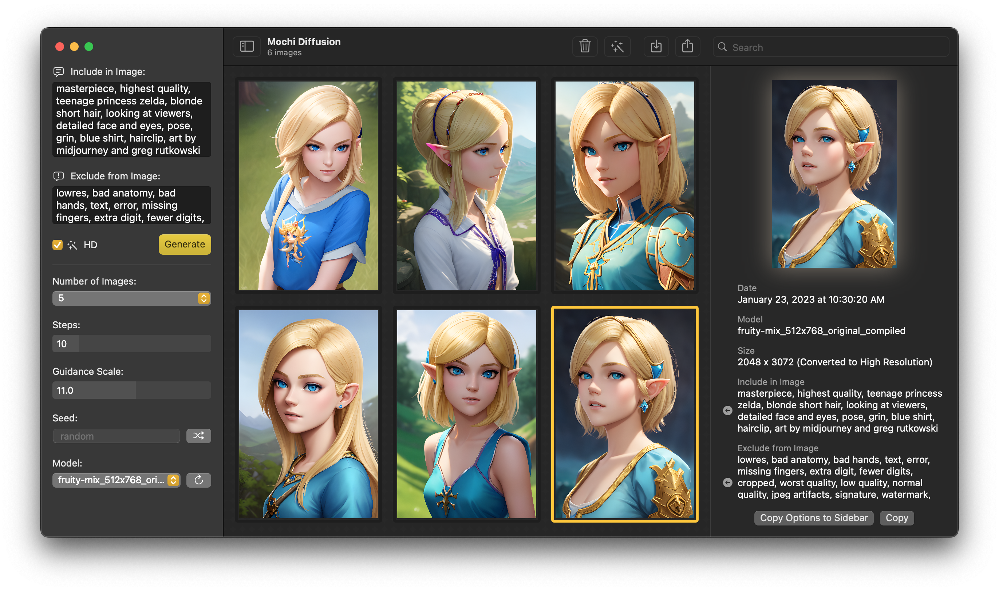

<h1 align="center">Mochi Diffusion</h1>

Run Stable Diffusion on Apple Silicon Macs natively

## Description

This app uses [Apple's Core ML Stable Diffusion implementation](https://github.com/apple/ml-stable-diffusion) to achieve maximum performance and speed on Apple Silicon based Macs while reducing memory requirements.

## Features

- Extremely fast and memory efficient (~150MB with Neural Engine)
- Runs well on all Apple Silicon Macs by fully utilizing Neural Engine
- Generate images locally and completely offline
- Generated images are saved with prompt info inside EXIF metadata
- Convert generated images to high resolution (using RealESRGAN)
- Use custom Stable Diffusion Core ML models
- No worries about pickled models
- macOS native app using SwiftUI

## Releases

Download the latest version from the [releases](https://github.com/godly-devotion/mochi-diffusion/releases) page.

## Running

When using a model for the very first time, it may take up to 30 seconds for the Neural Engine to compile a cached version. Afterwards, subsequent generations will be much faster.

## Compute Unit

- `CPU & Neural Engine` provides a good balance between speed and low memory usage
- `CPU & GPU` may be faster on M1 Max, Ultra and later but will use more memory

Depending on the option chosen, you will need to use the correct model version (see Models section for details).

## Models

You will need to convert or download Core ML models in order to use Mochi Diffusion.

A few models have been converted and uploaded [here](https://huggingface.co/godly-devotion).

1. [Convert](https://github.com/apple/ml-stable-diffusion#-converting-models-to-core-ml) or download Core ML models
    - `split_einsum` version is compatible with all compute unit options including Neural Engine
    - `original` version is only compatible with `CPU & GPU` option
2. By default, the app's working directory will be created under the Documents folder. This location can be customized under Settings
3. In the working folder, create a new folder with the name you'd like displayed in the app then move or extract the converted models here
4. Your directory should look like this: `~/Documents/MochiDiffusion/models/[Model Folder Name]/[Model's Files]`

## Compatibility

- Apple Silicon (M1 and later)
- macOS Ventura 13.1 and later
- Xcode 14.2 (to build)

## Privacy

All generation happens locally and absolutely nothing is sent to the cloud.

## Credits

- [Apple's Core ML Stable Diffusion implementation](https://github.com/apple/ml-stable-diffusion)
- [HuggingFace's Swift UI sample implementation](https://github.com/huggingface/swift-coreml-diffusers)
- App Icon by [Zabriskije](https://github.com/Zabriskije)
